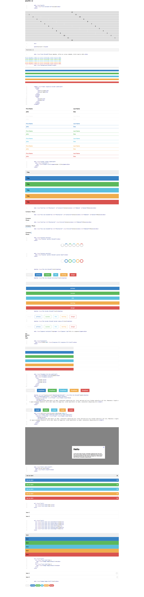

# psychic-ui

> a composable css ui library
- main-size: 22.38 KiB
- minified-size: 16.44 KiB



## dev-flow

> development

```
grunt start;
open http://localhost:8000
```

> commiting

```
grunt stats;
// replace stats output in readme
grunt start;
// to get new screenshot of docs
// commit like normal
```
